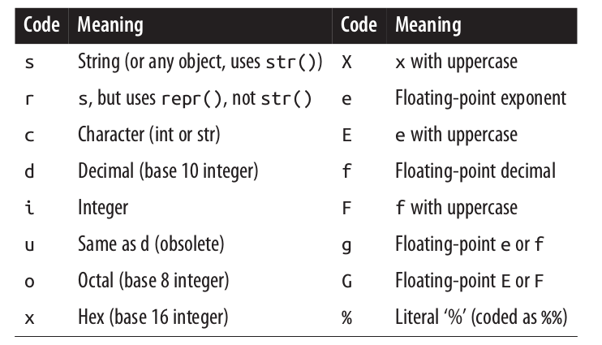

##Python##
  python file.py -c command -m module args
    ###options###
*    -bb with warning or errors
*    -d enable debug for core developers
*    -i interactive mode
*    -q like -i but without versions or copywright
*    -v verbose like message where a module is loaded
*    -x skip the first line to cater #!/usr/bin/sh
*    -c command like "print()"

###operator###
* data type: list[] , sets{}, tuple()
* differ: list is changeable, sets is unindexable, tupe is unchangeabke.
* list[:2:5:-1]  forward include, not hte backward.
* **str** a immutable sequence, for ASCII and unicode
* **bytes** immutable sequence of immutable short integers, for byte value of binary data.
* **bytearray** mutable variant of bytes

  ####Differ bt 3 and 2####
- python 3 treats all text as unicode strings and represent binary data separately, python 2 distinguishes 8-bit text from possibly wilder unicode text.

