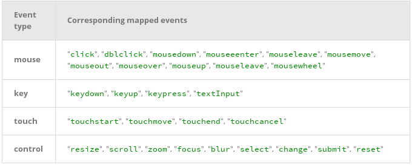

Content-Type: text/x-zim-wiki
Wiki-Format: zim 0.4
Creation-Date: 2014-09-29T11:19:57+08:00

====== Samples ======
Created Monday 29 September 2014
http://www.68ecshop.com/goods-586.html#com_b

##Console API##
- console.assert(expression, object) :: if expression is false then log the $obj
- console.dir()
- console.dirxml()
- console.log(), console.error(), console.info()
- formatter: %s string, %d int, %O js object

##Console API##
- $_ returns the mostly evaluated expression
- $0, $1,$2,$3, $4  returns the mostly selected dom element
- $() == document.querySelector(); $$() == document.querySelectorAll()
- clear(), copy(), debug(funcName), undebug(fn),
- dir(obj), console.dir(obj) show properties of obj
- inspect(obj/func), getEventListener(obj)
- keys(), values()
- monitor(func), unmonitor(func)
- monitorEvents(obj,events) :: monitorEvents(window,["resize","scroll"])

- table(array)

